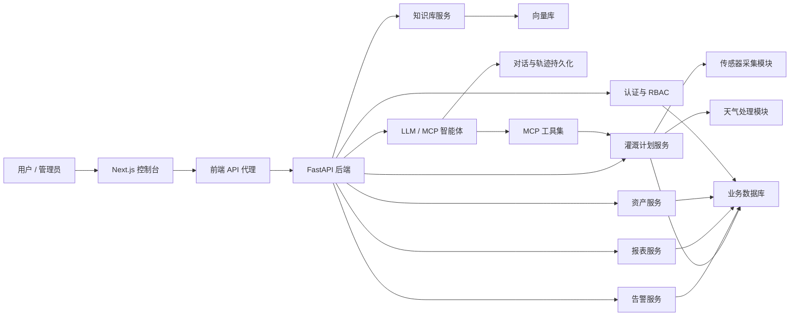
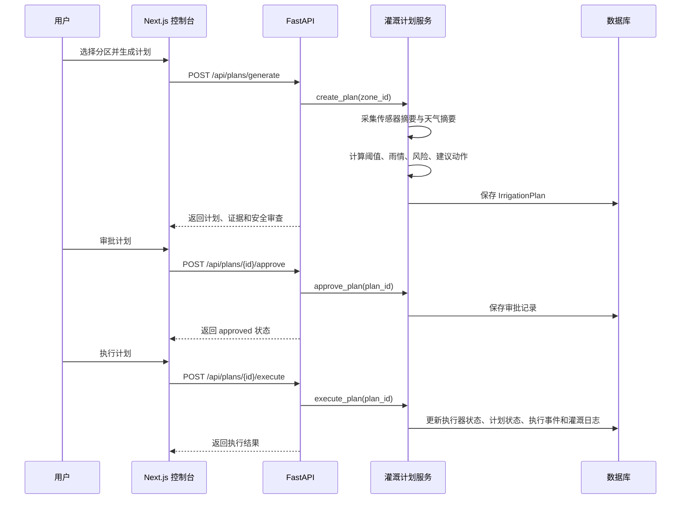

# HydroAgent 系统架构说明

本文档用于毕业设计论文、答辩和项目交付说明。当前系统定位为“智能灌溉仿真与决策原型系统”，重点验证软件侧的感知、分析、计划、审批、执行、审计和可视化闭环。

## 架构总览

## 后端分层

- API 层：`src/main.py` 注册 FastAPI 应用和路由，`src/api.py` 提供核心对话、分区、计划、灌溉、设置和状态接口，`src/routers/` 承载资产、告警、用户、报表、知识库和分析接口。
- 服务层：`src/services/` 承担业务编排，重点是 `irrigation_service.py` 中的分区证据收集、计划生成、审批、拒绝、执行和日志写入。
- 数据层：`src/database/models.py` 统一定义业务表结构，当前开发环境默认 SQLite，可扩展 PostgreSQL / MySQL。
- 智能体层：`src/llm/` 提供 LLM 智能体、MCP 工具、参数解析、事件流和会话持久化。
- 支撑模块：`src/data/` 负责传感器和天气数据，`src/knowledge/` 负责知识库，`src/security.py` 和 `src/services/rbac_service.py` 负责认证与权限。

## 前端分层

- `frontend/src/app/`：Next.js App Router 页面和 API route。
- `frontend/src/components/`：业务组件与 UI 基础组件。
- `frontend/src/lib/backend.ts`：后端请求封装。
- `frontend/src/lib/backend-proxy.ts`：前端 API route 到后端 FastAPI 的代理。
- `frontend/src/lib/auth.ts`：服务端登录态读取和权限守卫。

前端页面包括运营总览、智能对话、运营中心、资产中心、知识库、告警中心、用户与角色、报表中心、审计记录和系统设置。

## 核心业务流程

## 安全规则落点

- 没有结构化计划时，系统不应直接启动灌溉。
- `start` 计划默认需要审批，拒绝计划不可执行。
- 未来 48 小时存在降雨且湿度未进入紧急区间时，计划保持 `hold`。
- 传感器缺失、执行器不可用、执行器已运行等情况会进入阻断或风险路径。
- 后台操作通过 RBAC 权限控制，关键操作写入审计记录。

## 仿真边界

- 传感器：`DataCollectionModule` 默认生成合理范围随机数据，用于无硬件环境演示。
- 天气：天气查询失败时会返回离线兜底摘要，避免计划流程中断。
- 执行器：当前主流程在数据库中更新执行器状态和灌溉日志，未直接驱动物理阀门或水泵。
- ML：`SoilMoisturePredictor` 默认使用 DummyModel，主要保留模型接口和扩展点。
- 旧 UI / 控制模块：`src/ui/` 和 `src/control/` 保留早期兼容实现，当前主流程以 FastAPI + 服务层 + Next.js 为准。

## 可扩展方向

- 替换传感器模拟层为 MQTT、串口、Modbus 或 HTTP 设备网关。
- 替换执行器状态更新为真实硬件驱动适配器。
- 使用真实历史数据训练湿度预测模型。
- 增加任务队列，处理定时巡检、自动计划生成和异步通知。
- 增加 Playwright 演示测试和后端主链路集成测试。
